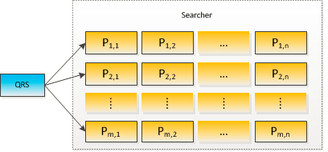
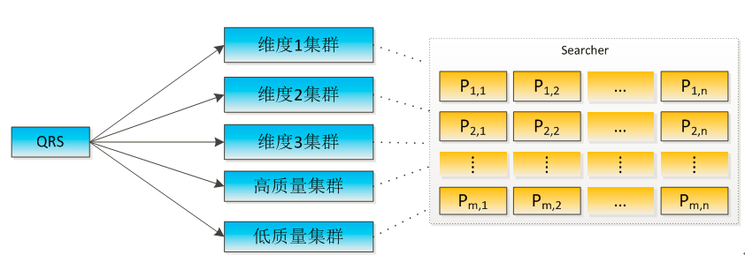
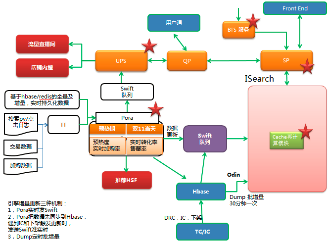
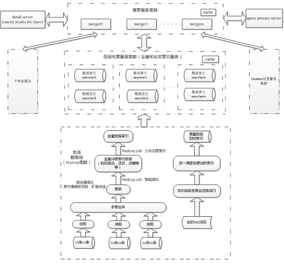

> **摘要:** 搜索是一种非常普遍而通用的服务。不同的搜索服务有着共同基础技术（倒排索引，文本相关性等），但对于特定领域也有着很明显的差别。电商搜索是搜索服务的一种，电商搜索面向的对象主要是商品，其目的是让用户更快的找到满意的商品。本文介绍淘宝搜索、京东搜索、1号店搜索的架构，总结电商搜索系统的架构特点。

**关键词:** 搜索引擎、电商搜索、系统架构

## 电商搜索引擎的特点

1. 电商搜索引擎要处理的原始数据本身就是结构化的，通常来自于数据库，且有多个数据源。相比与传统的搜索引擎，电商搜索在数据采集方面更侧重于各种数据源的数据更新。
2. 就是电商搜索引擎的过滤功能其实比搜索功能要常用。甚至大于搜索本身。电商搜索面对的通常是商品名称，而商品名称是一个短文本标题，很难从文本相关性方面得到非常明显的差异。
3. 电商搜索引擎支持各种维度的排序，包括支持好评、销量、评论、价格等属性的排序。而且对数据的实时性的要求非常高。电商搜索对数据的实时性要求主要体现在价格和库存两个方面。
4. 电商搜索引擎的效果不仅要考虑买家（信息消费方，结果多样性），还得考虑卖家（信息提供方，爆光率）

## 淘宝搜索引擎架构

> 淘宝搜索引擎从索引到搜索和排序都是自主构建、实现的，在整体架构上相对比较复杂。下面从搜索分层、实时更新、SKU 搜索三个角度分析淘宝搜索引擎的特点。

### 搜索分层

_思路_ ：根据商品质量，可以分为 good 和 bad 两种类型。预先将商品分类为 good 和 bad，然后建索引的时候分别建在不同的索引之中。检索的时候，先从 good 索引中检索信息，如果 good 索引返回足够多的结果，则不从 bad 索引中检索，如果 good 索引中返回的结果不够，再从 bad 索引的查找结果补充。整体体思想是数据预处理和分而治之。

如上图所示，这是最原始的搜索架构，商品不做任何分类处理，每个查询都需要遍历整个大集群的所有商品。

如上图所示，根据商品质量分类的思路，可以在建索引的时候将商品分为高质量商品和低质量商品，分别放在不同的集群之中，搜索的时候先从高质量集群中检索，高质量集群没有满足结果再从低质量集群检索结果进行补充。
可以注意到，上图中还有维度1集群、维度2集群、维度3集群这样的分布。原因在于，商品按质量分层部分解决了机器数量多与查找范围广的问题，仍没有解决索引结构单一与支持排序算法种类少的问题。对于常用且需要大量计算的排序比如人气排序，可以将这些排序中规则中质量较高的商品放到一个单独的索引和集群中去，这样可以加快某些排序规则的检索效率。

* 索引商品的顺序不再受原始链的影响，可以灵活的采用自己特定排序方式，可使用的排序方案就会变多。
* 单独特定排序的集群的倒排链中得分高的商品在前面，得分低的在后面，检索算法很容易做动态截断，即不再需要完整的查找整个链。

>由此可以看出，淘宝搜索对索引的遍历是顺序遍历，在假定索引有序的情况下，只需顺序查找取回所需的条目数就行了，不需要完全遍历。相对整个大的索引集群，这种索引可认为是一种支持模糊查询的缓存。问题：如何高效的维护一个有序的索引结构？

经过以上步骤，参与检索的商品信息分布如上图所示：高质量与低质量集群索引的商品是没有交集，按检索条件和排序规则创建的商品索引是有交集的，即存在数据冗余，但这个冗余是可以接受的。

##### 最后整个的分层搜索架构如下图所示

**总结**: 淘宝的分层搜索基于数据预处理和分而治之的思想，在整个大集群上面构建了一些不同角度不同维度的小集群，分散流量，从而达到节省硬件资源的情况下提高检索效率。

### 实时更新

上图中标五角星的是实现数据实时更新、实时干预结果的重要模块

> PORA：PORA是搜索离线团队针对实时个性化业务场景打造的一套离线实时计算系统。高效的完成数据分析和数据同步。

> UPS：UPS是搜索技术部门提供个性化服务存储计算的在线系统，承担了包括搜索个性化在内的众多业务线上全量实时KV/KKV数据的低延迟的存储、查询和计算服务。在本次双11实时流量调控中，UPS在提供用户个性化数据等原有服务的基础上还存储了PORA实时更新的流量调控数据，供下游天猫双11直播间使用。

> Isearch5: ISearch5是搜索最新一代引擎平台，服务于淘宝、天猫、B2B等各个搜索业务线，支持秒级实时索引、辅表等众多新特性。在本次双11实时流量调控中，**_PORA产出的实时售罄率和转化率字段正是通过Swift消息实时更新的索引字段。_**ISearch5引擎中还包含一个战马框架可以支持嵌入算法的排序模块，**_算法在对应的流量调控排序模块中可以获取到PORA实时更新至引擎的售罄率和转化率字段值，从而实时影响排序结果，达到调控流量的目的。_**

> SP ：SP是搜索面向前端应用的统一服务接口，根据用户指定的查询条件制定查询计划，查询包括QP/UPS，ISearch5引擎在内的各个搜索后端系统，得到最终结果返回个前端。SP通过将业务逻辑从前端往后端下沉，简化了搜索调用逻辑，提升了前端系统性能。

> BTS 服务：BTS是搜索的分桶测试管理服务，搜索的一次服务首先从BTS中获得自己所属的测试，BTS确保一个用户的前后多次访问获取到的始终是相同结果，测试信息作为一个查询条件通过SP传给后端各个系统，后端据此可以进行分桶测试。具体到本次双11的实时流量调控需求，引擎的战马框架中配置的算法排序模块会根据传入测试信息不同进行不同权重的流量调控排序，从而帮助算法对比和优化模型。

**总结：**淘宝搜索支撑实时数据实时干预主要是通过强大的离线计算系统和高性能的消息中间件，同时索引文档支持 _按字段更新_，提高索引更新效率。

### SKU 搜索

通常搜索是以商品为单位，但商品信息具体到 SKU 上还是有区别（比如 iPhone 5s，白色的 16G iPhone 5s）。

SKU 搜索要解决数据冗余问题，因为 SKU 信息和商品信息有很多重合的地方。淘宝的解决办法是以商品信息为主表，抽离的 SKU 信息为子表，同时查询主表和子表，然后根据主表到子表的转换公式，完成结果的去重和过滤。

这实际上是一对多的关系。一个商品信息文档对应多个 SKU 信息文档。

### 淘宝搜索引擎架构总结

淘宝搜索引擎架构具备分布式、可扩展的特性，索引模块、查询模块、排序干预模块都实现了架构上的分离，方便对各个模块进行单独的优化和改造。文档索引支持按字段更新。并且配备强大的消息中间件、数据实时处理系统。

## 京东搜索引擎架构

从上图可以看出，整个京东搜索引擎的架构分为三大块：

1. **离线信息处理系统**
   由于商品数据分布在不同的异构数据库当中有KV有关系型数据库，需要将这些数据抽取到京东搜索数据平台中，这分为全量抽取和实时抽取。
   对于全量索引，由于商品数据散布于多个系统的库表中，为了便于索引处理，对多个系统的数据在商品维度进行合并，生成商品宽表。然后在数据平台上，使用MapReduce对商品数据进行清洗，之后进行离线业务逻辑处理，最终生成一份全量待索引数据。
   对于实时索引，为了保证数据的实时性，实时调用各商品信息接口获取实时数据，将数据合并后采用与全量索引类似的方法处理数据，生成增量待索引数据。
2. **索引系统**
   此系统是搜索技术的核心，在进入这个系统之前，搜索信息仍然是以商品维度进行存储的。索引系统负责生成一种以关键字维度进行存储的信息，一般称之为倒排索引。
   此系统对于全量和增量的处理是一致的，唯一的区别在于待处理数据量的差异。一般情况下，全量数据索引由于数据量庞大，采用hadoop进行；实时数据量小，采用单机进行索引生产。
3. **搜索服务系统**
   搜索服务系统是搜索真正接受用户请求并响应的系统。由于用户体验的需要，首先增加Query Processor服务，负责查询意图分析，提升搜索的准确性。随着访问量的增长，接着增加缓存模块，提升请求处理性能。接着随着数据量（商品量）的增长，将包装服务从检索服务中独立出去，成为detail server服务。数据量的进一步增长，对数据进行类似数据库分库分表的分片操作。这时候，在线检索服务由多个分片的searcher列组成。自然而然，需要一个merger服务，将多个分片的结果进行合并。至此，搜索基础服务系统完备.

**除了以上三大模块，京东搜索引擎架构还实现了排序与架构的分离，排序接受反馈系统的实时干预**

### 京东搜索引擎架构的几个特点：

1. 离线信息处理系统完成数据的整合与加工，索引系统只做数据的索引和更新。

2. 彻底消灭掉了索引更新存在的一切锁机制，商品新增和修改操作变为链式更新。使商品信息更改频繁，涉及千万级索引写操作的大促期间，商品的索引更新达到秒级。

3. 对搜索的缓存进行了针对性的优化，实现了三级缓存结构。从底向上分别是针对term的缓存，相关性计算缓存和翻页缓存。最上层的翻页缓存很多时候会被用户的个性化请求击穿，但是底层的相关性缓存和term缓存的结果可以起到作用，这样不至于使CPU负载过高。

## 1号店搜索引擎特点

> 1号店搜索引擎架构相较与淘宝和京东的搜索引擎架构没有太大的突破。但也基于 Lucene，自主实现了索引模块、查询模块和排序模块，实现了架构上的模块分离。1号店搜索引擎的特点在于高效的 Sharding 和 Routing 的设计。

### 按照类目来切分 Shard 的策略。基本操作为：

1. 按照一级类目切分 Shard。

2. 如果该 Shard 过大，则按照二级类目继续切分。

3. 经过前两步之后，如果切分后的 Shard 过小，则按照相关性进行 Shard 合并。

### 按照搜词和类目做 Routing 策略。

1. 对于类目导航，原理上非常简单，按照类目ID来查找 Sharding 策略，就可以确定需要访问的 Shard，虽然现实中还需要考虑扩展类目等特殊场景，但是也不难做出一个简单的 Routing 策略。再加上类目数是有限的，Routing 规则在 Broker 本地内存就可以缓存起来。

2. 搜词场景复杂很多，仅凭词本身很难判断它属于哪个Shard。解决办法是首先按照词的热度分为两类，采取不同的 Routing 策略。对于热词，搜词流量同样符合80-20规则，20%的热词占比80%的搜索流量，对于热词，可以在建完索引之后，就跑一遍热词搜索，记录哪些 Shard 有结果，离线构建出热词 **_Routing 表_**。切换索引时，Routing 表也一起加载进去。对于非热词，则采用首次搜索去访问所有 Shard，根据结果记录 Routing 表，这个词在下次搜索时，就有了缓存可用。

**总之，基于丰富的 Sharding 和 Routing 规则，减少每次检索需要查询的数据量。**

## 电商搜索引擎架构总结

要做好一个电商搜索引擎，主要需要解决一下几个问题：

1. 信息处理系统。索引文档的预处理过程，可靠的索引数据来源。
2. 数据更新问题。强大可靠的消息中间件推送，索引文档支持不加锁更新（字段更新）。
3. 密集流量的响应处理（缓存，Routing），减轻全量索引的查询压力。
4. 易于扩展排序算法干预，与业务相关的排序处理与搜索基础组件的分离。算法设计者无需关心数据来源问题。
5. 分布式索引和查询，提高搜索引擎的可扩展性。

从以上几个问题出发，可以发现淘宝搜索引擎、京东搜索引擎和1号店搜索引擎的架构都基于相同的模式，只是侧重点各有不同。但都本着模块分离原则，每个模块做好自己的事情，模块之间协作，从而提高搜索引擎系统的效率。