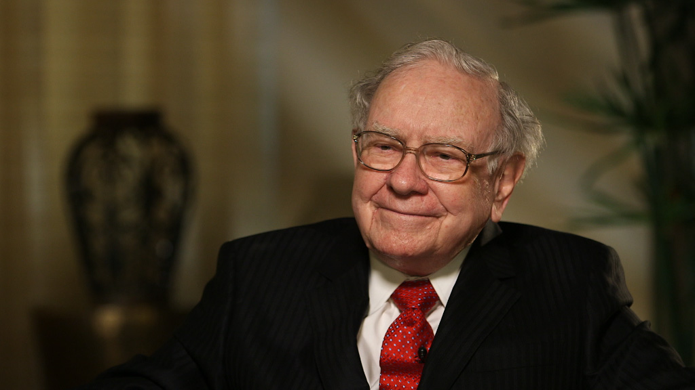

<https://www.madewill.com/master/charlie-munger-speech.html>

# `转载`查理·芒格演讲：一生抓住少数几个机会，够了！

2021年1月1日

2018年，95岁的投资家查理·芒格在最近Daily Journal（《每日期刊》）公司年会演讲上，仍旧保持着一贯直率而睿智的谈话风格。会上芒格笑语不断，金句迭出，深入浅出地传达一些关于投资的理念和哲学思想。

查理芒格的100个思维模型

芒格非常看好中国市场：“中国的水可以。有些聪明人已经蹚进去了。时候到了，更多人会进场。中国的好公司比美国的好公司便宜。”

### **01常识：平常人没有的常识**

伯克希尔哈撒韦能取得巨大的成功，Daily Journal （《每日期刊》）能小有成就，没什么秘诀，就是追求基本的道德和健全的常识。大家都知道，所谓常识，是平常人没有的常识。

我们在说某个人有常识的时候，我们其实是说，他具备平常人没有的常识。人们都以为具备常识很简单，其实很难。我举个例子。大量高智商的人进入了投资领域，都想方设法要比普通人做得更好。许多高智商的人蜂拥而至，在投资领域形成了别处罕见的景象，于是，怪事发生了。

加州曾经有一家非常大的投资咨询公司，为了超过其他同行，它想到了一个点子。他们是这么想的：我们手下有这么多青年才俊，个个是沃顿、哈佛等名校毕业的高材生，他们都为了搞懂公司、为了搞懂市场趋势、为了搞懂一切，不遗余力地拼命工作，只要让这些青年才俊每人都拿出他认为最好的一个投资机会，我们把所有最好的机会集中起来形成组合，必然能遥遥领先指数啊。

这家投资公司的人能觉得这样的点子行得通，是因为他们接受的教育太次了。他们满怀信心地付诸行动，结果毫无悬念地一败涂地。他们又试了一次，一败涂地。他们试了第三次，仍然失败。

几百年前，炼金术士幻想把铅变成金子。炼金术士想得很美，他们觉得买来大量的铅，施一下魔法，把铅变成金子，就发大财了。刚才说的这家投资公司，没比几百年前的炼金术士高明到哪去，它不过是妄想把铅变成金子的现代翻版，根本成不了。本来我可以把这个道理讲给他们的，但是他们也没问过我啊。

值得人深思的是，这家投资公司集中了全球各地的精英，甚至包括许多来自中国的高智商精英，中国人的平均智商比其他国家的人略高一些。

其实，这个问题很简单。这点子看起来行得通，为什么在实际中却行不通？你不妨自己想一想，为什么会这样。你们都接受过高等学府的教育，我敢说，在座的人之中，没几个真能把这事儿解释清楚。

我想借此给大家上一课。你们怎么能不知道呢？投资领域可是美国的一个重要行业。在这么重要的一个行业，出现了如此惨重的失败，我们应该能给出一个解释啊！能回答出这个问题的人，肯定是在大学一年级的课堂上，全神贯注地听讲了的。

令人遗憾的是，即使你把这个问题拿到一所高等学府的金融系，让那的教授回答，他们也答不对。我把这个问题留给你们思考，因为我想让你们感到困惑。我接着说下一话题了。

其实，这个问题，你们应该能答上来。从这个问题，我们可以看出来，即使是一些非常简单的事，要保持理智也特别不容易。人们有太多太多错误的想法，都是不可能行得通的。

人们错误的想法为什么行不通，你们却讲不出来。如果你们接受了良好的教育，应该能一眼看透。我理解的“接受了良好的教育”，是知道什么时候教授是错的，而且知道什么是对的。

教授说什么，就是什么，这谁都做得到。关键在于，你要分辨，教授讲的东西，哪些对，哪些错，这才是接受了良好教育的人。

### **02一生抓住少数几个机会，够了！**

回到投资领域，至少在未来相当长的一段时间内，如果你主动选股，并且妄想无所不知，你仍然跑不赢指数。在伯克希尔哈撒韦，在 Daily Journal，我们一直比平均水平做得好。

问题来了，我们怎么做到的呢？我们怎么做到的呢？**答案很简单。我们追求做得更少。**

我们从来没天真地以为把一批青年才俊招进来，就能无所不知，无论是汤罐头、航空航天，还是公用事业什么的，都能比别人懂得更多。我们从来没这么妄想过。我们从来没以为自己能做到，不管在什么领域，我们都能获取到真正有用的信息。

我们不把自己装成无所不知。我们始终很清楚，只要我们特别用功，我们能准确找到少数几个机会。这少数几个机会足够了。

只求找到少数几个机会，我们的预期更合乎情理。假如你像我前面提到的那家投资咨询机构一样，你去问沃伦·巴菲特同样的问题：“告诉我你今年最看好的投资机会。”然后，你买入沃伦找到的那个最好的投资机会，你肯定能赚翻了。沃伦不可能妄想无所不知，他告诉你的只会是一两只股票。投资咨询机构雄心勃勃，沃伦更知道克制自己。

沃伦巴菲特

我的太姥爷，也就是我妈妈的爷爷，对我帮助很大。我太姥爷是一位拓荒者。他来到爱荷华州的时候身无分文，但是年轻，身体好。他参加了与印第安人打的那场黑鹰战争，在战争中当了上尉。后来，他在爱荷华州定居下来，每次，在出现土地非常廉价的机会时，他就非常有头脑地出手，大笔买入。

最后，他成了小镇上最有钱的人，还拥有银行。他受人尊敬，有个大家庭，过着非常幸福的生活。他刚在爱荷华州定居的时候，一英亩土地还不到一美元，他一直住在爱荷华州，亲眼看到了富足的现代文明在这片肥沃的土地上兴起。

我太姥爷说，他赶上了好时候，一辈子活到90 岁，老天能给他几个大机会。他这一生幸福长寿，主要是老天给他的那几个机会来临时，他抓住了。

每年夏天，当孙子辈的孩子们围绕在他膝下时，我太姥爷总是一遍一遍地讲这个故事。我妈妈对钱不感兴趣，但是她记住了我太姥爷讲的故事，并且讲给了我听。我和我妈妈不一样，我知道我太姥爷做得对。

所以说，我还很小的时候，我就知道了，重大的机会、属于我的机会，只要少数几个，关键要让自己做好准备，当少数几个机会到来的时候，把它们抓住了。大型投资咨询机构里的那些人，他们可不是这么想的。

他们自以为，他们研究一百万个东西，就能搞懂一百万个东西。玩好投资这个游戏，关键在于少数几次机会，你确实能看出来，一个机会比其他一般的机会都好，而且你很清楚，自己比别人知道的更多。

像我说的这么做，只要抓住少数几个机会，足够了。沃伦经常说：“一个人，居住在一座欣欣向荣的小城里，他有这座小城里三家最好的公司的股份，这么分散还不够吗？”只要这三家公司都是拔尖的，绝对够分散了。

广为流传的凯利公式可以告诉我们，在自己占有胜算的时候，在每笔交易上应该押下多少筹码。你的胜算越大、成功的概率越高，你下的注应该越大。

### **03在有鱼的地方钓鱼！ 切记！**

钓鱼的第一条规则是，在有鱼的地方钓鱼。

钓鱼的第二条规则是，记住第一条规则。

我们很多人去了鳕鱼已经被钓光了的地方，还想钓上鳕鱼来。在竞争极其激烈的环境中，你再怎么努力都没用。在投资领域，即使很小的机会，也有人在跟踪。有一次，我参加密歇根大学的投资委员会会议，会议上其中一位取得成功的投资者来自伦敦。这位投资者在伦敦是怎么投资的呢？

他看中了撒哈拉以南非洲地区。撒哈拉以南非洲地区上市的公司很少，只能找到几个在粉单市场上市的银行股，于是他买入了这些银行股，能买的量很少。非洲的穷人逐渐改变把钱放在家里的习惯，越来越多的人开始把钱存入银行，这位投资者也越来越赚钱。最后，他赚了很多钱。没有别人投资非洲的小银行，只有他自己。

可惜，这个小小的利基很快被填上了。作为基金经理，投资撒哈拉以南非洲地区的小银行，为客户赚了钱，下一个投资机会上哪儿找去？利基填平是很快的。一个在伦敦的基金经理都能去买非洲小银行的股票，你说赚钱的利基还能剩下多少？太难了。

### **04走正道，路越走越宽**

在我们生活的现代世界中，有人专门拉别人下水，教别人频繁交易股票。在我看来，这和教唆年轻人吸食海洛因没什么两样。蠢到家了。一个已经赚到钱的人，怎么可能以教唆别人炒股发财为生？电视也是个神奇的地方，在电视上我们经常看见，有人说“我手里这本书可以教会你每年赚 3 倍，你只要付邮费就能得到这本书。”

一个人，突然发现了每年赚 3 倍的秘诀，怎么可能还在网上卖书？

太可笑了,我说的这一幕是现代商业的写照。人们每天都在做这样的事，还自以为自己是对社会有益的公民。我再讲个小故事，也是关于现代生活的，希望你能从中得到启发。这个故事发生在从前。

有个人，他有一匹好马。这是一匹骏马，步履轻盈、毛发光亮。这匹马什么都好，就一个毛病。有时候，它突然脾气暴躁、性情顽劣，谁要是当时骑着它，非得被摔得断胳膊断腿不可。

这个人找到了兽医，他问兽医：“该怎么治治这匹马呢？”兽医说：“很简单，我有办法。”这个人说：“快告诉我吧。”兽医说：“你在你这匹马表现很好的时候，把它卖掉。”

总的来说，沃伦（指沃伦·巴菲特）和我，我们两个人从来没为了赚钱，忽悠傻子从我们手里接货。我们赚钱，靠的是在买的时候赚。如果我们卖的是狗屎，我们不会把狗屎说成包治关节炎。

我觉得，别去骗人，还是像我们这么活着比较好。在现实中，骗子总是有。就说那些江湖骗子吧，他们蒙人的伎俩多着呢。总有骗子利用人性的弱点牟利。我们必须增加自己的智慧，才能远离种种欺诈。

彼得·考夫曼（《穷查理宝典：芒格的智慧箴言录》作者）和我说过很多次：“如果骗子知道做老实人能赚多少钱，他们肯定都不当骗子了。”沃伦也讲过一句很经典的话，他说：“走正道，路越走越宽。”此言不虚。

### **05慢一点，我们不在乎**

有些道理很简单，却真的很受用。Daily Journal 做的是难做的生意，为法院等政府部门服务的工作不好做。法院等政府部门需要自动化。别人想占法院等政府部门的便宜，我们没有。

我们只是一家小公司，我们做得很辛苦，我们也逐渐占领了很多市场。速度虽然慢，但前景光明。有钱的好处在于，慢一点儿，我们不在乎。那我们是怎么有钱的呢？

我们记住了我太姥爷的话，机会只有少数几个，当一个机会来临时，我们扑过去把它抓住。想一想，你们的人生是不是这样？再讲一个我的亲身经历。

1970 年代，我犯了个错误，一笔该做的投资，我没做。没犯这个错的话，芒格家族的财富是现在的两倍。我犯的那个错太傻了。我错过了那个机会，否则我的资产是现在的两倍。生活就是这样，错过一两个机会，难免的。

### **06找对象得找比自己优秀的**

我们身边总有这样的人，他们找到了比自己更优秀的伴侣。他们做出了明智的决定，也是幸运的决定。找到比自己优秀的伴侣，这是多少钱都买不来的。许多人是年轻时无意间找到了比自己更优秀的伴侣。其实，未必要碰运气，可以有意识地去追求。

很多人身上贴着醒目的标签，上面写着“危险，危险，切勿靠近”，还有人迎着往前冲。（现场大笑）不应该啊。你们笑归笑，这绝对是后果很严重的错误。

### **07老成这样了，为啥还能开心？**

我们这个董事会里的人，大家一起做特立独行的事，共度人生的坎坷，算是够奇葩的了，毕竟我们年纪都这么大了。盖瑞·威尔科克斯 (Gary Wilcox) 算我们这里的年轻人了。我们是个很独特的董事会。这个案例也值得各位思考。你看我，岁数这么大了，老成这样了，还活得很开心。怎么做到的呢？这是另一个话题了。

你们愿意听，我再讲两个小故事。下面这个故事是编出来的，但是很启发人。一位年轻人去拜访莫扎特。他说：“莫扎特，我想写交响乐。”莫扎特说：“你多大了？”年轻人说：“我 23。”莫扎特说：“你太年轻了，写不了交响乐。”

年轻人说：“可是，莫扎特，你 10 岁的时候就开始写交响乐了啊。”莫扎特说：“没错，可我那时候没四处问别人该怎么写。”

还有一个关于莫扎特的故事。莫扎特可以说是人类有史以来最伟大的音乐天才。他的生活过得怎么样呢？莫扎特一肚子愤懑，郁郁寡欢，英年早逝。莫扎特怎么活成了这样呢？

他做了两件事，谁做了这两件事都足以陷入痛苦。莫扎特不知道量入为出，在金钱上挥霍无度，这是第一件。第二件，他内心充满了嫉妒和抱怨。谁要是挥霍无度，还充满嫉妒和抱怨，一定能活得又苦又惨，早早离开人间。想活的苦，想死的早，请学莫扎特。

那个年轻人请教莫扎特如何写交响乐，你们从这个年轻人的故事中也能学到一个道理。这个道理是：有的东西，有的人学不会。有的人天生就比你强，你再怎么努力，也总有人比你更强。

我的心态是：“那又怎样？”我们现场的这些人，有哪一个是非得站上世界之巅不可的吗？没那个必要。

帝王将相修了那么多规模庞大的陵墓，我总觉得很可笑。难道他们是为了让后世的人羡慕自己？让后世的人在走过他们的陵墓时希望能住进去？（现场笑声）总之，我们一路走来，很享受其中的过程，最后也做得很好。

你可以自己去研究一下，在Daily Journal 公司，在伯克希尔哈撒韦公司的历史上，一共做了多少个重大决定。重大的决定，平均算下来，每年没几个。

这个游戏的玩法是：始终留在这个游戏里，盯住了，在稀有的机会出现时，别让它溜走，要知道每个普通人能分到的机会并不多。

### **08.如何低成本地从错误中爬出来？**

赚钱的秘诀是节约支出、生活简朴。沃伦和我，我们年轻没钱的时候，我们都是省着花钱，把钱攒下来投资。坚持一辈子，最后很富足。这道理谁都能懂。

生活中需要解决的另外一个问题是：怎么才能不付出过高的代价，从错误中爬出来？从错误中爬出来，我们做到了。伯克希尔哈撒韦，它最开始的生意是什么？穷途末路的百货商店、穷途末路的新英格兰纺织公司、穷途末路的印花票公司。

伯克希尔哈撒韦是从这些烂生意里爬出来的。好在我们买得非常便宜，虽然一手烂牌，我们还是打得很好。最后伯克希尔能取得成功，是因为我们换了一条路，改成了买好生意。**我们能成功，不是因为我们善于解决难题，而是因为我们善于远离难题。我们只是找简单的事做。**Daily Journal 公司，我们刚买的时候，它的生意很好做。

现在 Daily Journal 做的软件生意，很难做。公司的老同事都还健在，在种种机缘巧合下，新的软件生意做得还可以。这生意有潜力，我们也愿意做下去。报纸已经走向衰落，有几家报纸能像 Daily Journal 一样，账上躺着数亿美元的股票，还经营着有前途的新生意？我们是最后的莫西干人。

### **09.提问环节**

问：您有一句金句，我特别喜欢。您说过，您在招聘的时候，一个人智商130，但认为自己的智商120，另一个人智商150，但认为自己的智商170，您会选择前者，因为后者能把你搞死。

芒格：这说的不是埃隆·马斯克吗？我当然要选知道自己几斤几两的人，不选那些自不量力的人。我自己会这样选，但我也学到了生活中一个非常重要的道理。这个道理是和霍华德·阿曼森学的。他讲过这样一句话：“千万别低估高估自己的人。”

高估自己的自大狂偶尔竟然能成大事，这是现代生活中让人很不爽的一部分。我已经学会适应了。自大狂偶尔能成为大赢家，但我不愿一群自大狂在我眼前晃来晃去，我选择谨慎的人。

问：您说，好机会虽然好，如果做过了，却要吃大苦头。如何不完全错过，又不做过头？如何才能避免进场太晚？如何判断好机会已经过头了？

芒格：把问题彻底想明白，问题就解决了一半。你已经说了，这是个矛盾：好机会，刚开始进场的时候，潜力十足；好机会，做过了头，危机四伏。你脑子里清醒地绷着这根弦，什么机会，是什么类型的，自己去分。这个问题，你已经解决一半了，你不需要我帮你。你自己已经知道该怎么做了。既要看到潜力，又要看到危机。

问：在伯克希尔的致股东信中，您也写了伯克希尔的过去和未来，您讲到了伯克希尔之所以能取得成功的几个原则。我的问题是，伯克希尔作为一家控股公司遵守了一些原则，取得了巨大的成功和优异的记录，为什么其他公司不和伯克希尔学？

芒格：我觉得最主要的原因是学不来。例如，像宝洁这样的大公司，它的固有文化、它的官僚作风，早已根深蒂固，你说怎么能把宝洁变得像伯克希尔哈撒韦一样？这个问题可以直接分到“太难”一类。太难了，已经不可救药了。人们还是没意识到官僚主义的危害有多大。

伯克希尔能取得今天的成就，原因之一在于总部根本没几个人。伯克希尔没官僚主义的毛病。伯克希尔有几位内部审计员，总部有时候派他们出去巡查。总的来说，我们没官僚主义的毛病。没有官僚主义，上层的管理者又头脑清晰，这是我们的巨大优势。

问：我的问题是关于长期利率和复利的。过去几年，利率一直很低，很难找到实现长期复利的策略。除了投资伯克希尔、价值投资、指数投资，请问能以高复利长期投资的机会在哪里？

芒格：你问我如何实现理想化的高复利，我的建议是，降低你的预期。我觉得，在一段时间里，应该很难。让预期符合实际，对你有好处，你不至于抓狂。我们经常听到有人说，从几百年以来最严重的那场大萧条到现在，不计算通货膨胀，投资股票指数的年收益率是 10%。扣除通货膨胀，大概是7%左右。

在这么长的时间里，7%和10%能拉开巨大的差距。我们就算实际收益率是每年7%。取得这个收益率的时机非常完美，恰好是在大萧条之后开始并且经历了人类历史上最繁荣的时期。从现在开始投资，实际收益率完全可能只有3%或2%。未来人们投资的年收益率是5%，通货膨胀是3%，这样的情况完全可能出现。

真出现了这种情况，正确的心态是告诉自己：“即使出现了这种情况，我也能活得很好。”我们这些老年人生活的那个年代，哪有你们将来的生活条件好，你们有什么可郁闷的？

除了正确的心态，如果将来投资更难了，你应该采取什么实际行动呢？答案很简单，因为难度提高了，你应该更努力。可能你努力了一辈子，最后超过了5%，得到的是6%，你应该高兴。

问：在分析一家公司时，您更看重投资收益率这样的定量指标，还是品牌优势、管理层素质这样的定性因素？芒格：我们关注定性因素，我们也关注其他因素。总的来说，在具体情况下，什么因素重要，我们就关注什么因素。什么因素重要，需要具体问题、具体分析。

我们总是遵守常识——平常人没有的常识。我刚才讲了，把很多东西扔到“太难”的一堆里，这是平常人没有的常识之一。

问：我还处于不知道自己的能力圈在哪的人生阶段。我想请教您，您是怎么找到自己的能力圈的？

芒格：知道自己的能力圈边界非常非常重要。连边界在哪都不知道，怎么能算是能力圈？没那个能力，却以为自己有，肯定要犯大错。我觉得，你得始终对比自己能做到什么、别人能做到什么，你需要始终坚定地保持理性，特别是别自己骗自己。

从我一生的阅历来看，理性地认识自己的能力这项特质主要是由基因决定的。我觉得像沃伦和我这样的人是天生的。后天的教育很重要，但是，我认为，我们生下来就具备了投资成功所需的性格。我没办法让你回到娘胎中重生。

问：今天的很多问题都是在问您长寿、幸福的秘诀是什么。

芒格：这个很好回答，因为道理很简单：不嫉妒，不抱怨，不过度消费；面对什么困难，都保持乐观的心态，交靠谱的人，做本分的事……都是些简单的道理，也都是些老掉牙的道理。做到了，一生受益。

愿你在探索智慧的路上走得更远~