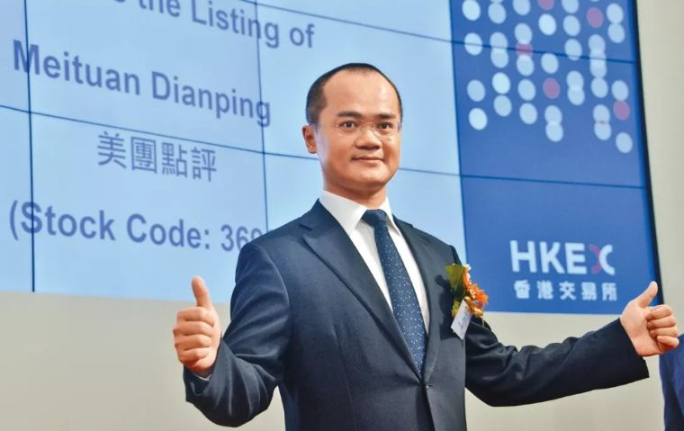

https://mp.weixin.qq.com/s/wpnUf2JClhobdZmTrv3RCg

# `转载`王兴：你对未来越有信心，对现在越有耐心

当美团的市值超过6000亿港元，成为阿里腾讯之后排名第三的互联网公司之后，多年前那个曾经让人觉得有点可惜（有种说法是，互联网欠王兴下一次成功），今后将成为互联网发展和理论研究绕不过的一个企业家。

王兴天生就是一个好的创业者，从校内网（后被千橡互动收购后改为人人网红极一时）到饭否（比微博更早的中国Twitter形式），再到美团的成功上市，王兴具备一个成功创业者的本性。

当年阿里67号员工的干嘉伟，放弃了规模比美团大的窝窝团的邀请加入到美团，正是看到了王兴身上独有的特质，对产品、用户需求的洞悉。

干嘉伟看到的是，以后中国互联网大概五年十年之后，拎出十个人，王兴会是其一。

王兴也有不足，比如干嘉伟所擅长的对人的组织管理等，这也是干嘉伟与其共事多年来，对其带来的成长和改变。

在千锤百炼中不断学习，不断成长，王兴才成为我们现在看到的王兴。王兴是什么？是其天生的产品经理般对事物的洞察，加上后天不断对组织管理等方面的学习，融其一身。

每一年，王兴都会在美团进行内部讲话。从2011年到上市前夕的2018年，通过这些内部讲话，我们可以看到王兴这8年来思想历程的变化，对行业认知的演进，这背后，也是王兴认知的变化历程。

**中国商业互联网的发展，有一个金字塔，分三层，代表不同规模、不同数量的企业。**所有企业都是需要做推广的，互联网作为一个传播信息很好的平台，它可以作为商业推广的最好方式，但是不同的环境下面，不同规模的企业，它会找到不同的适合它的互联网推广方式。

最早在2000年左右，中国商业互联网的开端，**最大的企业在金字塔的塔尖有世界五百强，像宝洁、宝马，**2000年开始做推广，新浪首页放展示广告，按展示付费，只有很少一部分企业参与。

互联网继续发展，到2005年很多企业，制造企业、外贸企业，它们有推广需求，但是它们没有资金实力去门户投广告，或者效果不够精准，回报不够高，但是2005年它们发现有一种互联网网站，有一种新的商业模式可以帮助它们，那就是搜索，这些中小企业原来不可能按展示付费在门户网站投广告，但是它们可以在搜索引擎，在百度、谷歌里面搜索，按照点击率付费，这样离效果近很多。

**所以按点击付费的商业模式的企业，通常来讲规模会比上面一层小一些，但是数量大很多。**像新浪之类的门户网站，它的广告客户就那么几百家，或者在千家量级，但是像百度，它可以达到几十万个客户。所以，这5年间互联网往前走了一步，之前没法利用互联网做商业推广的企业，找到了新的商业模式。

又过了5年时间，到了2010年，到了3月4日，美团网在国内开创了团购的方式。这样我们可以满足更多的企业的需求，大家来看**金字塔的塔基，在这里面的企业它可能单个规模都比较小，或者说它是本地的服务企业，**它的销售半径超过5公里、10公里，客户就不太可能来到这里消费。

这些企业，这些本地商家，虽然规模比较小，但是数量非常多，按照国家统计局的统计，有700万家（到2017年底， 2017年底，中国中小企业数量达2726.3万家），这些企业都需要进行推广。以前门户网站帮不了这些企业，搜索引擎帮不了它们，搜索引擎虽然是按点击付费，但是这么多本地商家可能根本连网站都没有，点击量没有意义。他们不关心展示，不关心点击，他们关心有多少客人到他们店里消费，他们关心交易。

所以他们希望有一种互联网推广方式能够直接帮助他们带来交易，完全按照效果付费，这个事情美团网可以帮助他们做到。

我可以非常诚实地说，我衷心地认为团购的模式是人们有史以来最优美的商业模式之一。

我们认为手机非常重要，我们已经发布了Android美团客户端，在手机上使用美团网就会更加方便。智能手机里面还有一个重要的平台，iPhone，美团的iPhone已经提交申请。

在过去一年里，从去年3月4日第一天上线起，我们首创一种方式，10元邀请返利，我们不想乱花钱砸广告，我们相信口碑相传。

今天我们提出一个更劲爆的措施，不需要邀请，直接注册，直接返10元。

但是现在美团网要推出“过期退”。所有过期的余额，我们会全额返还，百分之百返还，让之前所有信任美团网，参加美团网团购，到后面不管因为什么原因没有去的会员放心。他以为是损失的，其实没有损失。我们实行的种种措施就是希望消费者尽可能放心，消除消费者选择美团网的后顾之忧。

关于对商业模式的理解，我想商业模式其实不是最关键的事情，因为一个模式可以非常简单、非常透明，商业模式是共通的，关键是看执行力，这是我对商业模式的理解。

**短期可以有各种各样的花招，但是长期来看生产力决定生产关系，效率高的商业模式一定会胜出，**对处在金字塔塔基的这些商家来讲，美团网这种商业模式比门户展示付费和搜索引擎按点击付费更适合他们的需求。所以长期来看，更好的商业模式会胜出。

单个商家接单能力有限，我们不可能一个单有几十万单，所以这个时候，为了更好地满足客户需求，我们做了适当的划分，每天不止一个团购项目。（团购鼻祖Groupon当时还是每日一团）

校内网有很多本地化的改动，但是因为它们比较细微，所以大家没有感觉。最早在国内是按邮箱后缀来识别大学的，这个非常简单，非常容易理解，但是我们在2005年做校内网时发现有些学校没有，北航这种很好的学校就没有，所以我们不可能按照这种方式操作，需要按其他方式，在校园里注册，或者按IP来做，这都是很小的差异。

人群也是一样，也是一个金字塔。**互联网普及最早是从受教育程度最高的人群入手，随着时间的推移，互联网普及会逐渐下沉，**在人群上会下沉，越往下越接近本地，越接近线下，整个大的趋势是如此的。

巨大的潮流当中，有很多的机会，每一个机会都会有足够的空间让公司去成长。所以这个阶段，我们没有必要说一下把所有东西糅合在一起，**我们选好一个事情，把它做专做精，让在这个行业里面服务的各方都满意，我觉得一定会有很好的前景。**

**另一方面，也可能是被很多人忽视的方面，是我们花在技术研发上面的资金。**电子商务的核心是低成本、高效率，这个效率不是完全靠堆人，人要成长，人数要增加，而更多是靠技术平台的研发。不断积累消费者和商户数据，我们才能知道商家需要什么样的消费者，消费者需要什么样的项目。我们能够实现数据积累更精准的匹配，同时能够让客户很方便地用。

互联网企业发展至今，没有一个实施的本地化战略能够做大，所以很多人会质疑美团的战略。但是，搜索引擎，在1998年大家认为这是一个完全没有商业模式的行业，之前有那么多人做了，完全没有效果，完全没有商业模式。

我有一个朋友，2000年读完研究生在北大天网。当时有两个人从国外回来，在北大资源楼租一个办公室，想做搜索引擎，想挖最好的人，很多人去了，他没有去。他认为：“搜索引擎我能做得很好，但是这个事情没有商业模式。”所以他没有去。这个公司就是百度，后来上市，再后来成为中国最大的互联网公司之一，也是全球第五大互联网公司。

**这个故事告诉我们，一个事情只要它长期有价值，虽然它很有难度，但是过去做不成，不代表将来做不成。**

本地电子商务是一个庞大市场，因为几百万家企业都需要营销，需要推广，需要销售，之前试过搜索方式不太行，试过评价方式似乎也不那么有效，我们终于到了一个很有趣的历史时间点，终于出现一个很好的商业模式，满足这些存在的需求。问题一直存在，可方法一直没有找到，现在我们可能接近找到了。

有些非常年轻的员工，现在22岁（王兴此处指的应该就是沈鹏，现水滴互助CEO沈鹏），从去年还没有毕业就加入美团网，到后面开拓外地市场，这样一些年轻人不到一年的成长历程给我们很大的惊喜，也让我们知道，在这个行业里面年轻人是有机会的，年轻人是有优势的。有激情，有干劲，这个事情并不难。

在接下来的发展中，**我们判断一个人是否来美团网，关键不是他的年龄，是他的状态**——有干劲，能够理解消费者要什么；有冲劲，朝九晚五不适合我们。那些愿意认同这个目标，愿意投入一切努力去承担一切责任，承担更多责任的人是我们需要的人。

时间2012年 背景：拉手上市失败，千团大战结束前夕

在1911年12月之前，没有哪个地球人到过南极点，所以这是一百年前所有最伟大的探险者、所有最有探险精神的人最想做到的事情。而在这个过程中有很有趣的故事，他们的故事和我们将要进行的事情有几分相似，他们的教训、他们的经验对我们来讲有借鉴意义。

最后两个竞争团队，一个是来自挪威的阿蒙森团队，另一个是斯科特团队。

阿蒙森团队五个人，斯科特十七个人。他们出发时间是差不多的，这是因为这个世界上竞争从来都非常激烈，当有一个大的机会的时候，没有可能只有你看到了，基本是差不多时候有一帮人也看到了，这跟其他无数的场合竞争都很像，一个真正有吸引力的机会，会在差不多同一时间有不止一个团队、不止一个公司或者不止一个人参与，一定会有激烈的竞争。

阿蒙森团队在两个多月后，率先到达了南极点，而斯科特团队他们晚到了一个多月，这意味着什么？这就是成功跟失败的区别。

阿蒙森率先到达南极点，并在21个月之后顺利地返回了原来的基地，一切都按他们原来的计划进行，因为他们做了非常充分的调研，非常精心的准备，储备了足够的物资，对困难有足够的预料，按计划进行。而斯科特团队不断地有人掉队，不断地碰到困难，最后他们没有任何人生还。

**成功跟失败的区别不光是你是否获得荣誉，是否完成目标，而已经是生与死的差别。**

这些前辈进行的探险比我们更困难、更刺激，赌注更大。那么是什么造成这么重大的区别，对我们在做的事情会有些帮助和启发。

事后有人总结分析两个队的策略和准备，可以看到非常重要的区别。

阿蒙森的团队人虽然少，但是物资准备非常非常充分，他们准备了三吨的物资；而斯科特团队的人多，但是准备的东西少，只有一吨的物资。一吨的物资够吗？如果你在这个过程中不犯任何错，完全不犯任何错，刚好够。物资确实是够的，但是前提是你在这两千两百多公里的路程中，不知道地形、不知道天气的情况下，你不能犯任何错。如果你不犯任何错，这一吨物资确实够。大家知道这是多么可怕的事情，理论上可行，但现实中碰到很大的压力、碰到很大的未知困难，你不可避免地会动作走形，会犯很多错。

**所以，当你的计划订得太紧的时候，当你的准备虽然貌似够，但是不充分、没有富余量的时候，其实是非常非常危险的。**

阿蒙森团队物资有极大的富余量，在行进过程中，他们可能会错过一个事先准备好的补给站，或者说丢掉一些东西，或者说碰到一些比原来想象的温度更低、暴风雨天气更长的时候，但他们依然能够有足够的物资储备。

只有这种做法才是够的做法，不是将将够，而是充分预知到这个环境多么困难，要做多么多么充足的准备，要给自己留下犯错的空间，或者对我们来讲是学习的空间、成长的空间。

所以这是一个非常非常大的区别，资源是否足够，是否有空间。

另外还有很多区别，例如，他们采用的工具不一样，也就是说他们事先做的准备不一样。阿蒙森是挪威人，他为了去南极做了非常多的准备，首先要去哪个地方，要完成哪个目标，最好的工具是什么？最好的办法是什么？要学习最好的办法，采用最可靠的、最先进的工具。

跟南极最像的地方就是北极，他跑去北极和爱斯基摩人住了很长一段时间，包括如何用冰天雪地里最好的工具——狗拉雪橇。

而斯科特团队犯了很多错，一样要拉雪橇，他选择了比狗更壮、更强悍的马。事实上，这是一个很大的错误，狗和马有很多差别，狗在雪地里是不会出汗的，而马会出汗，一出完汗再一冻就被冻住了。所以马虽然比狗强悍很多，看起来快很多，但其实并不是一个合适的工具，看起来威猛，看起来快，其实它不适应这个环境。

后来很快发现不行，他们想用更冒险的方法，用最先进的工具——雪地摩托。这是一百年前，雪地摩托整个内燃机都是非常不成熟的，如果雪地摩托这种最先进的工具能用的话，很可能非常快，非常威猛，但事实是，他们搞去的雪地摩托才走一段时间就被发现不行，因为这是一个太新的东西了，虽然理论上可能可行，但是从来没有人在这么严酷的环境下，在没有很完善的情况下用这个东西。

**这是一个很重要的区别，在同一个环境下面，目标大致相同，你选择什么样的路径，你用什么样的方法，你做什么样的准备，最后很有可能不光是成功与失败的区别，而是生与死的差别。**

还有一个非常非常重要的策略区别，就是不管天气好坏，阿蒙森团队坚持每天前进大概30公里，这句话听起来非常简单，但是事后总结，这个是阿蒙森团队能够不断成功而且生还的一个非常重要的原则。

这里有很多讲究，在一个极限环境下面，你要做到最好，但是你要做到可持续的最好，你就不能太努力，一旦你出汗就非常非常糟糕，一兴奋，出汗了，那么待会儿风一吹就结成冰了。**所以任何时候，太激进其实很有可能会带来长期的负面影响。**

做到这点需要高度严守既定的纪律，在事情容易的时候，在环境顺利的时候，不要得意忘形，坚守纪律，当情况好的时候，似乎容易的时候，前进30公里，然后扎营、休息。当天气不好的时候，阿蒙森也坚持带领他的团队，哪怕挪得很慢，也要前进30公里，完成这一天的目标。因为本身设的目标是有富余量的，天气不好就慢一点儿，路陡就慢一点儿，但坚持去完成。

阿蒙森制订了一个可行的计划，有富余量的计划，虽然他们面对的几乎是一个完全未知的领域和未知的天气，但他们基本按计划执行。相反，斯科特团队，从他们的日志来看，是一个比较随心所欲的团队，**天气很好，就走得非常猛，天气不好的时候，就睡在帐篷里，诅咒恶劣的天气，诅咒运气不好，希望尽快天转晴，尽快能够前进。**

这是很自然的反应，很多人容易有这样的想法，容易的时候多搞点儿，不容易的时候，季节不好、天气不好、市场环境不好，就歇一歇。但事后总结，这两种做法很可能是他们最大的区别。

这个故事它跟今天我们所处的环境、我们要干的事情有很多相似之处。

我们相信商品的电子商务和服务的电子商务最终规模是差不多的，它的最后规模都是上万亿，我们同样面临一个目标，要去做本地电子商务。

最怕的是我们对自己估计不足，对这个情况认识不足，所有困难只要我们意识到它，我们相应地去做准备，去克服，都是有可能克服的，最怕的是我们对情况估计不足。

我们应该像去探索南极的阿蒙森团队一样，充分利用、学习现有的一切最好的方法，适合我们的方法，对困难有足够的估计，目标清晰，同时制订计划，去坚定地执行。我们在2011年的目标是每个月增长20%，大概一年接近10倍。

**我们可以从阿里学习很多东西，但是最终我们一定要超过阿里。**我们要向任何一个对手学习，任何一个同行学习，但我们最后目标应该是超越它们，这是整个公司的目标，也应该是每个人的目标，不管你在哪个岗位上，总有办法可以做得更好，学习新的东西，目标是超过它们。

上市不是我们的目标，应该是我们在到达一个更长远的目标的过程中，在合适的情况下发生的事情。

**你不能把上市作为目标，而是应该有更坚实的目标，要服务好消费者，服务好商户，让整个企业能够健康持续地运转。**那个时候上市是水到渠成的事情。

在上市之前，另一个事情非常重要，因为公司整个事情是大家一起做出来的，美团最重要的产品、最重要的资产都是人，我们希望上市的时候一方面给公司带来资金，另一方面能让大家分享这个胜利的果实。所以在去年下半年的时候，我们第一次有了全员持股计划，只要加入公司一段时间，足够长的时间，每个人都有的。

2011年上半年大家疯狂投资，各种各样的高得离谱的估值，后来下半年如我们所料，冬天来了，可能不光是团购的冬天，不光是电子商务的冬天，甚至认为是整个互联网、整个投资的冬天。现在也一样，很多人认为市场环境不好，这一切其实都是像他们去南极探险时候的天气好坏变化，有的时候晴天，有的时候阴雨天一样，都大致在可控范围之内。

**我们不依赖运气，我们要像成功的阿蒙森团队一样，像他们每天不管天气好坏坚持前进30公里一样。**

只有这种看起来不那么激动人心的方式，其实是最考验毅力的，也可能是最有产出的。一个简单的事情重复做，越做越好，越做越专业，不管是在哪个岗位上，这个事情听起来似乎很枯燥，但是它其实蕴含着无数的激情，这是真正的激情，并不是莫名其妙的不同的变化，而是你做成的事情，你要希望把它做到最好，做到越来越好，要做到比最好还更好，每天越来越好。

这是一个很难的事情，但是是一个很激动人心的事情，也是非常值得努力的事情。

时间：2013年 背景：美团成为全国团购的老大，美团外卖年底上线

**1. 每一次花钱都是在投票，投票选择你想要支持的那个世界**

大概三年前，当美团规模还非常小的时候，曾经有朋友问我，你之前做校内网，做饭否，它是一个社交媒体、社交网络，看起来是不是更能影响信息传播，更有社会意义的事情；做电子商务做美团也很好，但是不是有一点儿俗了。我毫不犹豫地，而且非常理直气壮地告诉他：不俗！

我觉得一个非常重要的事情是，每个人都有花钱的自由，所以，**我们每一次花钱都像在投票，在用钞票投票，投票给你想要的那个世界。**你用你手里的钞票，没有人能够阻挡你，它作为你的选票，决定你要支持什么样的公司，支持什么样的企业，你要跟什么样的人做生意，你要到什么样的地方消费，你认为什么企业应该在这个竞争中获得更多选票，赚更多钱，能够发展得更好。

这是每个人的自由，每个人都有选择的权利，有消费的民主，而美团干的就是这样的事情。它给每个人更多选择、更多自由，然后也让那些诚信的、提供优质服务的商家能够在这种投票的选择中获胜，而发展得更好。

所以，我想反复强调这一点，我们每一次花钱都是在投票，投票选择你想要支持的那个世界。那么每一次投票就是一次交易，交易额代表投票的多少，代表你影响了多少消费者，我认为交易额对美团非常重要。

淘宝天猫发展得非常好，它的主力是做商品的电子商务，我们完全有理由相信服务的电子商务是一个规模完全不逊于商品的电子商务，甚至更大，是需求更充分的一个市场，这一点也可以从另外一个报告中看出来。

大家关注宏观形势的话，就可以看得出刚刚2012年全国的GDP和各个产业的分布，**我相信2012年是第三产业产值小于第二产业产值的最后一年，**第三产业就是服务业，跟第二产业工业的产值差距在飞速地缩小，2012年应该是最后一年第三产业小于第二产业，从2013年开始，统计报告肯定会是第三产业服务业总产值大于第二产业，而美团恰恰做的是第三产业，是服务业的电子商务。

回顾过去三年，展望未来一年，还要展望未来三年。所以，这里我想跟大家分享另一个目标：2015年我认为美团应该实现全年1000亿的目标。（2012年美团55.5亿）

2015年全年1000亿，1000亿是什么意思，难吗？听起来是个很大的数字，但其实并不是遥不可及，**因为再难的事情你只要把它分解、分解，再分解，然后每一步都有人负责，都有团队负责，每个人都靠谱，那整个事情就都靠谱。**

如果把1000亿这个看起来很大的数字稍微分解一下，我们就会发现，只要我们顺利地完成今年188亿的目标，后面2014年、2015年，平均每年只要增长140%，也就是每年2.4倍，到2015年我们就能顺利地完成1000亿的目标。每年增长140%，这是比我们所有过去几年都要慢得多的数字，10倍、3.8倍、3.4倍。

完全有理由相信，只要我们不犯错误，只要我们产品方面更加深入，商品选择更加丰富，能够始终保证高质、低价格，然后保证非常便利，不光在PC方面，更在手机方面，因为消费者需求是如此旺盛，而商家的需求也是如此强烈，我们有理由非常快速地发展，到2015年我们希望美团全年交易额能够超过1000亿。

大家注意看，我的标题是“从美团的三年到O2O的十年”。基本上，本世纪第一个十年是传统电子商务蓬勃发展的十年，到2010年年初，随着团购的发展，O2O才真正开端。

大胆地展望一下，到这个十年，O2O的前十年结束的时候，到2020年的时候，我相信美团全年的交易额能超过一万亿（2018年美团交易额为5156亿）。

我希望跟大家分享一下最简单的事情，从1000亿到10000亿是十倍，如果我们给自己五年的时间，平均每年只要增长60%，也就是1.6的5次方是超过10，当整个第三产业是数十万亿的时候，当五年后互联网普及进一步提高，消费者手机上网的普及度进一步提高的时候，我们没有理由不相信这整个产业会是一个巨大的产业，而我们作为这个产业的领跑者，有理由相信应该把目标设定在超过10000亿上面。

所以，这是目标，目标不管宏伟不宏伟，其实你只要去分解它，就可以理解它，而且我相信一个高的目标是会对每个人有激励作用的，这是过去三年给我最大的感受。

O2O的十年将注定是一个既牛×又苦×的十年，为什么说苦×呢？是因为大家都知道，我们不管在哪一个部门，哪一个环节，竞争都非常激烈，消费者、商家各种各样的需求，而这个事情注定是一个高品质、低价格、低毛利的事情。

这里我们要记住一句话：你对未来越有信心，你对现在越有耐心。可能现在过去的三年，接下来一年，接下来两年、三年，都会是非常煎熬的、苦×的事情，但是，整个事情是有非常光明、巨大前景的事情。

2013年年初制定了三个目标，我们完成了其中两个，但另一个指标我们没有完成，就是全年交易额188亿，我们完成了160亿。我觉得这个事情没必要隐瞒，它是什么样就是什么样。

今天当我展望2014年的时候，我想重点说两个词，第一个词是——“危机”。**如果你希望在一个好的创业公司一路高歌猛进的话，每一年都是关键的一年，这一句话每一年都是对的。**

虽然我们已经做到了团购市场超过50%市场份额，但是我们做的事情是本地电子商务，我们要的不只是全国的领导位置，我们要的是在每个城市都占有领导位置。

我们现在占据了50%多市场份额的领域，只是300多亿、400亿的份额，Offline有几万亿，Online只占了1%左右，在这个1%里面，我们只占了50%多，这又算什么呢？

不管是传统互联网的巨头，还是像万达这样传统商业里的巨头，他们都喊O2O，大家都在往这个行业进入的时候，我们需要做得更好，如果我们不能做得更好，我们就处在一个非常危险的状态。**甚至可以毫不夸张地说，美团这个公司永远离破产只有6个月时间。**

**如果你在另一个公司，它认为它可以高枕无忧的话，那么它离死不远。**

这个行业、这个时代、这个世界变化特别快。凡是没有危机意识的公司，不战战兢兢的公司，不管它现在看起来多么强大，都是非常危险的，而且它比那些虽然小，但是始终保持非常警惕状态的公司和人更危险。

在现在的互联网行业里面，腾讯被认为是最强大的公司，但腾讯的leader马化腾曾经说：**“巨人倒下的时候，身体都可能还是温暖的。”**想要在这个时代、这个行业生存下去，我认为每个人、每个公司都要有这样的危机意识。

第二个词是“成长”。很多问题，正是我们成长太快带来的。单从交易额来看，阿里、京东、小米，没有我们快。

这样一个快速成长的环境带来了很多很多问题。**因为人的成长是需要时间和机会的，但公司的业务是每年两倍、三倍成长的时候，会带来很多问题，并不是每个人的每一步都能跟上。**

这时候我们需要轮岗的方式，需要更有耐心的方式，能够更好地解决这个问题。

5年前，那是在美团正式上线之前，在北京海淀区清华东门的华清嘉园，一个三居室，十几个人开了一个简单的座谈会，那时我们还面临很多困难，在那个会上，不少人落泪了，包括我。

在2012年，我们**狂开站、狂上单、狂拜访，**这一系列事情做下来，2012年底，美团已经初步确定了我们在团购的优势地位。我相信今天大家可以看到，我们之前坚持每天行进三十公里，三年累积下来我们取得了什么样的成绩。

在遇到问题时，我觉得不管对个人、团队，对整个公司来讲，有一个很多年前长辈告诉我的道理。

可能很多人听过鸵鸟原理。火鸡比母鸡要大一些，如果从旁观者的角度来看，确实火鸡比母鸡是要大一圈或者大两圈。但是，母鸡看火鸡，其实会觉得大家差不多，母鸡也是不太服气火鸡比我大的，它觉得你可能就比我大那么一点。

但是，当一只鸵鸟过来的时候，不管是母鸡还是火鸡，不管它们再不服气，在一个强大的反差面前它们都会认同鸵鸟确实确实比我大。这个道理非常深刻，人和人的对比，团队和团队的对比，公司和公司的对比，这个道理同样存在的。

所以在早期，可能我们认为我们的价值观比对手更正，我们团队比对手更好，我们的基础比别人更好，对手却不服，不要紧，这个时候争论是没有用的，我们要做的是什么？还是回到根本问题，**消费者第一、商户第二、团队第三、股东第四，**我们有足够的资源，足够好的团队，我们去合作足够多足够好的商户，然后和商户一起去把消费者服务好。

如今，美团在全国有两亿多用户，在手机上面美团是仅次于淘宝的最大的电商营销平台，比天猫大，比京东大。所以，只要我们能坚持往前走，坚持走得比对手更快，大家可以看到，曾经认为是我们对手的已经被我们远远的甩在身后。

**2. BAT进入O2O，美团到了该建平台、生态的一年**

**面对未来的挑战，我认为今年会是O2O真真正正大决战的一年。**团购的事情我们占60%的市场份额或者更高一些，但还没有完全的结束。在电影这个领域，BAT或者其他各种各样的公司，线上线下他们和我们一样，都在做很多尝试。

我认为今年应该是美团重点去建平台、建生态的一年。因为我们需要越来越多的产品服务去满足用户的需求，去满足商户的需求，而且不同的产品、不同的业务需要平台。我们还需要跟外部各种各样的合作伙伴有各种各样的合作方式。所以，今年不管是内部的发展还是外部的发展都需要我们有建平台、建生态的意识。

我相信今年的竞争会非常激动人心，而建平台、建生态这个事情在今年也是一个开端，是一个非常重要的开端。

**3. 不要高估两年能发生的变化，不要低估十年能发生的变化**

我相信比尔·盖茨的话，他说得非常对，**“人们总是倾向于高估两年能发生的变化，但是低估十年能发生的变化”。**五年也是如此，特别是在这个时代，两年看起来是很长的时间，而五年基本上回头看，我相信所有人都会同意发生的变化比大家想象的更多。

2015年是中国互联网历史上一个非常特殊的年份。这一年发生了很多互联网公司的合并，包括滴滴和快的，58和赶集，携程和艺龙、去哪儿。在这个大环境中，美团和大众点评也于2015年10月8号宣布合并。

我认为最简单的判断标准就是：你觉得某个服务够好吗？**你觉得你可以把它推荐给你的家人和朋友吗？**如果我们期望真正做好这个事情，成为一个长远有价值、令人尊敬的，大家也乐于在此工作的公司，我们必须解决好这个问题。

回答好这个问题，需要确保我们提供的服务，自己是自豪的，我们是有信心推荐给家人、朋友使用的。（这个判断标准）对各行各业也是如此，而且对我们这个行业尤其如此。因为我们提供的不再是一个简单的信息服务，而是实际接触到他们生活方方面面的服务、各种吃喝玩乐，所以回答这个问题的答案就尤其的重要。

我们目前最大的业务是到店餐饮，这个巨大的市场还处在初期，几乎可以非常清楚地看到一个大潮即将到来，这个行业将会有巨大变化。

在过去一年里，手机买单是往前迈了一步，部分的形成闭环，部分的改进了体验。

互联网在中国发展了十几年，已经到达了一个阶段。**我想大胆地做一个判断：纯互联网创业的黄金时代已经过去，**“互联网+”这个更大的机会正在到来。互联网依然会对人们的生活产生广泛剧烈的影响，但它提供的将是“互联网+各个行业”的服务模式。

要做好这一点的话，我们要**少谈一点颠覆，多谈一点创新。**如果要谈颠覆的话，最需要担心的是我们自己会不会被一个更新的模式颠覆。我们应该多谈一点创新，创新的最终目标是创造价值，降低行业运作成本，提高行业运作效率，提升用户体验。

最后，如果大家只能记住我今天谈到的一个事情，我希望大家记住的是：判断我们的服务是否足够好的标准是，我们是否愿意、放心地把它推荐给我们的家人。

整个中国的互联网也是刚刚进入“下半场”。之前中国互联网的发展，在很大程度上靠的是人口红利。但是现在这个时代已经过去了，智能手机的年销量已经不增长了，总体网民的增长也大幅趋缓。

对于整个中国互联网的发展而言，需要增长模式的转变，接下来考验的是大家的真功夫。

往后看，“互联网＋”要做的是各个行业从上游到下游的产业互联网化，不是仅仅停留在最末端做营销、做交易那一小段，而是真正能够用互联网、用IT全面提升整个行业的效率。我之前说过“少谈一些颠覆，多谈一些创新”，我认为整天讲“颠覆”是没有意义的，“互联网＋”根本上还是要靠创新服务于各行各业，靠互联网、靠IT技术为各行各业的各个环节提升体验、提高效率、降低成本。

如果以此为目标，那“互联网＋”需要的能力和之前就不太一样了。之前我们的发展基本还是“上半场模式”，就是猛抓用户、猛接商户，然后做“营销交易”这比较薄的一层。现在进入“下半场”的时候，就需要新的能力，之前我们并没有太多的积累，只能说有一些探索。但总体看，这种积累是有限的，目前我们还没有很完整的深入行业的能力，当然这对我们是巨大的挑战。

与此同时，我们也要看到，这对我们而言也是机遇，因为绝大部分互联网公司目前也没有这个能力，尤其是一些互联网巨头，他们也没有这方面的能力，甚至某些巨头由于历史原因，更难具备这样的能力，这对我们而言是个好事情。

下半场是几个层面，一个是我们美团点评这家公司要进入下半场，一个是互联网和移动互联网这个行业我们认为要进入下半场，一个是中国的产业、中国的经济要进入下半场，全球的经济和政治，我们认为也要进入下半场。

大家知道人在这个地球上已经生存了很多年了，但是在人的生存环境里面有很多东西是非常根本性的东西，只不过在地球上这么多年没怎么变，所以，大家不觉得。比如说空气，比如说水，还有一个比较重要的就是温度。

人生存对温度有多敏感呢？就是人的大脑，温度上限是42度，如果人的大脑的温度超过42度，人的大脑里面的用来思考记忆的那一部分蛋白质就发生化学反应了。一旦发生化学反应，就永远不可逆，就变成了一个没有生命力的固态物体，就变成痴呆。

现在很少人看到这种情况，要年纪稍微大一点的人，可能有人说这个人发烧烧痴呆了，发烧烧痴呆了就是大脑超过42度以后，那部分蛋白质发生化学反应。所以，这是人大脑的温度上限。人心脏的对温度也比较敏感，人心脏的温度下限据我了解应该是35度，心脏如果低于35度，就停了，就不泵血了。

所以，人生存的那个温度带其实非常窄，那这个窄的温度带在整个宇宙里面大概是一个什么水平呢？就是地球离太阳的距离如果变近1%，如果变远了1%，1%就超出那个温度带了，人就没了，整个人类社会就没了。

**宏观一小点点的波动，其实对于微观，对于我们每个生存的实体，我们的人类，我们的企业都是致命的打击，**致命的伤害，所以我们这家企业是极度关注宏观的一家企业。

2013 年的时候，当时有两个概念非常火，一个是 O2O，一个是互联网思维。这两个词都火的一塌糊涂，非常巧的是，我在那个时间点去美国搜索O2O和互联网思维的相关资料，发现一个让我非常震惊的事情，这两个词都是中国人造出来的。

**中国人创新能力还挺强，中国人创新的事，中国人不知道自己在创新。**

美国人真正知道 O2O 这个词，是怎么知道的呢？是李彦宏说他要花200 亿进入 O2O 这个市场，然后美国资本市场就问，什么是O2O，怎么出现一个 O2O 的东西，李彦宏要花 200 亿？美国人完全蒙了：突然出来一个叫 O2O 的东西，然后一个市值五六百亿美金的公司说要花一半的资金干这个事情，这到底是一个什么事情。

所以，当时李彦宏花了大量的时间跟他们解释什么是 O2O。所以，**我们在国内搞了很长时间的 O2O，真正把 O2O 出口到美国的主要就是 Robin** （李彦宏）。

所以 O2O 这个词是中国传播到美国去的，是中国人在教育美国人。我们在世界科技领域的创新里面第一次领先全世界了。回来观察中国的情况。我发现了一个让我非常震惊的事情，O2O 这个词不仅是在互联网圈内，投资界、媒体火，而且出现了一个新现象，在传统行业非常火。而且在传统行业比互联网科技和媒体圈还火，这是中国互联网上的第一次。

中国互联网历史上所有的新概念，新名词的传播规律都是什么？都是投资圈、媒体圈和互联网圈、创业圈先火，火完了之后，然后才是传统行业有选择的跟进。也就是这个传播过去一直是这样一个路径，但是在 O2O这个词火的时候，路径反过来了，传统行业这帮人比我们还热衷。

而且很有意思的是在 O2O 之前，我去参加所有的互联网会议，很少见到传统行业的人来参加。即便来参加，他们也说是来学习的。O2O 这个词火了之后，发现很多传统行业的人来参加，而且他们也在大谈 O2O。而且很有意思的是，我们说到底什么是 O2O，他给我解释半天，发现两个人说得还不太一样。

这就是 2012 年、2013 年发生在中国一个非常奇葩的事情。那么到底是什么导致 O2O 这个词在中国这么火呢？在中国传统行业这么火呢？其实原因非常简单，2012 年发生的事情，2012 年中国的自有服装品牌都出现了大规模的整个全行业的库存积压。服装行业的库存积压是非常恐怖的，基本上出不了就倒闭。

那服装行业为什么在 2012 年出现库存积压呢？中国的服装品牌基本上都是在 90 年代成立的，在过去的这些年，他们活的太滋润了，他们活的方法太简单了。

**服装企业基本上就做几件事这个公司就能成，第一，在央视打广告。第二，扩张发展开店。**

但是变化出现了。第一，新一代的90后成为消费主体的时候，他们的个人追求跟我们这一代，不是不一样，是走到了完全相反的方向。第二，消费者的注意力从电视里走出，玩游戏，在网上看小说，在网上看视频。传播消费者消费的注意力的平台发生了变化。

而现在2012 年之后，互联网公司终于可以在 A 股上市了。

比如说暴风影音，某企业，全都鸡犬升天，估值高的一塌糊涂。我当时就问了投行的人，我说怎么出现这种情况，估值怎么这么高呢？投行的人给了我一个答复，我认为这个答案是非常深刻的。他说你觉得估值高对不对？那我问你一个问题，你去看一下传统企业他们的增长评估。

比如说你看美国，某著名连锁餐饮品牌的增长率是多少你知道吗？2%。

**资本市场有非常多的钱，但是传统行业又不涨。钱没有地方可去的时候，就是有个人跟他讲一个可能性，他都愿意去掏钱。因为传统行业是没有可能性了，是注定死亡，所以钱就不会去了。**

钱可投资的标的变少了，比如说，欧洲多个经济体出现了负利率。

整个互联网在 A 股被炒上天了。某企业的老板跟我说他完全没有想到他能上市，他感觉这家公司都快倒闭了，他在 A 股上市是 700 亿人民币，对应100 亿美金。这是中国 2012 年、2013 年发生的事情，整个中国传统经济走到 2012 年、2013 年的时候，掉了一个非常深的坑。其实从那之后，会出现互联网的泡沫，在 2014 年、2015 年出现了非常大的互联网泡沫，原因非常简单。

就是当整个传统经济都不涨的时候，钱没有地方可去，所以他们就开始投互联网，大家不懂市场，网民、投资人都不懂互联网市场。因为钱没有地方可去，这时候看互联网公司都做得很好，就投资互联网。一开始在二级市场买股票，就在 A 股买股票。

后来发现在 A 股买股票，股票没啥买，就不去 A 股买了，咱们去买没上市公司的股票。所以，他们组基金，人民币组基金买没上市公司的股票。没上市公司的股票过了一段价格也搞上去了，公司融资是天使ABCDE 轮，然后一直往下，最后上市。

所以，就会出现一个公司还什么都没有，刚起一个团队，估值就 2 亿美金了。光一个团队刚开始就2亿美金了。

走到 2015 年到 2016 年，整个互联网和移动互联网出现了新的症状。

**第一，从互联网到移动互联网的转型基本完成了，****智能手机用户量不怎么增加了。**事实上整个移动互联网的体量就是几个数乘起来的，一是手机数，二是手机上的 APP 数，三是每个 APP 的使用时长，就这几个数乘出来的。

**第二，我们观察到了一种非常可怕的现象，用户在手机上，过去一段时间里是不断地装 APP，现在在不断地删 APP。**

我们给非常牛逼的投资人做了非常广泛的调研，**只有 11 个 APP能稳定在留在消费者手机上。**

所以最近一段时间大家看风投都不投钱了，因为没有新兴公司出来能拿到钱。还有一个非常恐怖的，在互联网时代，因为它是浏览器模式使用网站，所以用浏览器打开一个网站的时候，是从一个网站跳转到另外一个网站的门槛是非常低的，很多时候你都不知道你跳到另外一个网站，随便一点链接就跳过去了，这是其一。

其二，有搜索引擎这么奇葩的东西，可以把用户的流量分发到各个网站上去，但是到了移动互联网时代里面，你想从一个 APP跳到另外一个 APP，门槛是非常高的，大量的 APP 之间是不支持跳转的。因为不支持跳转，导致用户都被留在一个 APP 上去了，因为没有这种搜索引擎的分布式、去中心化的流量分发渠道。

现在在移动互联网上的流量分发渠道，APP 你要不下载怎么办？只有两个途径，一是买电子市场排名，二是买手机厂商预装。只有这两个选择，这两个渠道能推的量非常非常少，所以马太效应非常强。

手机厂商业务不涨的时候就要赚钱，赚钱怎么赚呢？因为消费者买了手机，手机就那么贵，他赚钱的方式就是向预装和电子市场要做推广的人收费，而且每年涨得非常厉害。

我们估测 2017 年预装费和电子市场费用会比 2016 年涨 30%，这些要素加在一起，对移动互联网公司来说是非常恐怖的，第一，手机数不涨了，第二，消费者的卸载，第三，推广费用涨 30%。所以整个中国移动互联网在 2016 年我认为就是一个分水岭，未来中国的移动互联网，明年移动互联网会非常惨烈，很多你们想象不到的公司会死掉。

**企业发展是三个阶段，是市场驱动发展、领导力驱动发展和创新驱动发展。**全球、中国的互联网的话，全球经济、中国经济和互联网经济都是同一个问题就是市场驱动的发展结束了。

市场驱动的发展有另外一个词叫红利，全球经济体在过去这些年的红利就是全球化和科技。

糟糕的是，从 2012 年到现在为止，这两个引擎熄火了，科技已经很久没有突破了，如果科技在未来的十年里没有突破，未来的二十年就一定会有战争。

Peter Thiel在二零零几年的时候就说到我们的科技很久没有突破了，我们要出问题了。

互联网过去这些年，全都靠网民增长，靠CPU速度变快，互联网的第一大红利是网民增长，第二大增长是摩尔定律，现在网民增长到头了，所以市场红利全都结束了，红利期结束。

在面临这些问题的时候，**如果按照企业发展三段论的话，应该从市场驱动切换到领导力驱动和创新驱动。**

如果看领导力驱动和创新驱动这两个解药的话，这两个方案里面，欧洲都已经用过了，欧洲他们已经非常发达了，创新也没了，所以欧洲是无解了。美国还有几年，因为美国没有把它自己的牌拿过来，所以美国应该问题不太大，欧洲注定要完蛋了，你们如果心怀梦想打算去欧洲旅游的话尽早去，晚了可能去了就有生命安全问题了。现在就已经有了，巴黎已经是一个很危险的城市了。

供给侧改革。整个产业都是两部分，一部分是需求侧，一部分是供给侧，需求侧就是消费者和市场，供给侧就是企业和供应商，就是商家。

做哪些变化呢？效率提升，成本降低，创新业务，提升用户体验。

我在2013年的时候做了一个事，美国科技界或者互联网圈的资本市场、科技业和互联网信息产业，美国的上市公司，我把它拉了一个名单，中国也拉一个名单，**事实上中国从总体上来说发展是跟着美国走的，因为美国可能很多创新技术先到了，所以我当时看说有哪些产业在美国已经产生了很牛逼的公司在中国还没被真正做起来，而且这个产业将来如果时机具备的话也会在中国是很牛逼的公司。**

这个方法论非常简单，我就把美国拉一个名单，把中国拉一个名单，来对比，我这个对比完了之后发现一个让我非常震惊的事，美国的互联网公司，很牛逼的比如 Facebook、Google、亚马逊，都是非常牛逼的，但是美国上市的科技公司里还有另外一派，也非常牛逼，只不过是这一派没有像互联网公司这种曝光多，名气大。

但是这一派其实都很挣钱，比如说 Salesforce，他们基本占据科技业的另外一半，在科技业的一半是 to C 的公司，他们占了一半的市值，在 2012、2013 年的时候，to B 的这些公司占了另外一半市值，比如说 Oracle，他们占了另外一半市值。所以其实还有很多很牛逼的公司，但是我们把这个来看中国的话发现中国 to C 的公司都很牛逼，最大的是阿里，然后是腾讯、百度，to B的公司居然找不到，就是说有活着的，但是活得很惨。

所以我就很纳闷，为什么中国这些 to B 的企业活这么惨呢？我就找了一些我认为比较有真知灼见的人交流，其中有一个人还是比较牛逼的，给了我一个答案，我认为这个答案是比较真实的，他说你看这是美国的 to B 科技企业做出来的，都是给企业或者给商家提供解决方案的。

我刚才说的Salesforce是销售团队管理解决方案，workday是HR解决方案，都是给企业和商家提供解决方案的。为什么这些提供解决方案的公司在美国活得很好，在中国活得不好呢？原因非常简单就是**美国这个国家商业周期非常长，因为商业周期长，所以任何一个企业所有能用来竞争和发展的东西基本上都用光了，他们的发展出现瓶颈了，当他们出现瓶颈的时候就开始搞内部提高效率，降低成本，创新服务。**

而他们要搞内部提高效率、降低成本、创新服务的时候，他们没有这些技术支持做不了，所以说白了就是美国的企业在过去这些年率先遇到了市场红利枯竭的状态，因为遇到市场红利枯竭，它就要寻求自己的效率成本和创新，它要寻求自身的效率成本和创新的时候就对各种新式的能提高效率降低成本的各种工具开始产生兴趣。

而过去中国这些年是什么情况呢？傻逼经营一个企业都能赚钱，这么说好像我们比傻逼还不如，我们还亏钱呢，我们是战略性亏损。**中国过去这些年实在是赚钱太容易了，大部分人存在的问题是不具备可能知道这个事情很容易赚钱的认知或者不具备进入这个行业的资本，**其实中国过去很多行业是极其赚钱的，非常多。

过去这些年整个中国市场、中国企业的发展特别容易，靠市场红利驱动就能发展，就能赚钱，所以他们对于新工具、新方法的采用意愿特别特别低。

走到今天，我认为这个事情发生变化了，所有的企业，所有的商家的经营因为遇到障碍了，所以当它的销售额不涨、利润不涨。

最近一段时间里面，我的判断是下一波中国互联网如果想回暖的话，一个非常重要的方向是供应链和to B行业的创新，是他们驱动的。供给侧如果要做改革的话，可能有哪些变化。

二十年前，互联网本身就是高科技，但到今天，多数互联网企业只是传统科技。

不管是20多年互联网的发展，还是更长时间接近50年的信息和通信技术的发展，底层都是有它的原理的，这是摩尔定律，65年因特尔创始人之一摩尔提出来，大概半导体的密度，平均每18个月或者24个月翻一番。

**摩尔定律在传统意义上已经到一个相对的固定临界，将来的全球增长的要素，可能是不同的方式，**现在总的芯片数量越来越多，因为全世界的能力不外乎整个芯片的计算能力，要看是不是芯片数量的增长，这个有点抽象，在底层跟我们的所有事情都相关。

每一个人需要很多的芯片，手机、电脑，但是车更多，一辆车近百个芯片，所以会有越来越多的数据，越来越多的计算和需求。

这里还只是高科技的一部分，我经常跟朋友交流，有一些朋友说，每次去硅谷回来，就觉得我们干的事情很low。

高科技方面创业，中国会有越来越多的空间，有越来越多的需求，这个创业不太一样，这不再是一个学生在车库里，或者在宿舍里捣鼓几天，就能做出翻天覆地的事情，他可能需要很多底层的积累，还有很大的投入，这个也需要耐心。

中国互联网有很大的成功，但更多人认为是商业模式的创新，而不是科技的创新，这个在过去是对的，因为中国总体是落后的，现在发展到这个阶段，甚至可能会超越美国，往后可能确实在底层上有很多投入，有很多AI专家说，AI方面国内并不落后，但是还有更多领域是需要更长时间投入的，因为我们说，摩尔定律以外，我们总体人才是在增加，这是需要国家投入的支持。

高科技是未来五到十年一个很大的驱动力，但是并不是单做，就像互联网跟各行各业结合在一起。

或者另一个例子高科技，因为美团是做吃的事情，2017年春节的时候，我看过一家公司，是不可能的食物，是一个教授创始的，当了26年的生物化学教授，他认为人们都喜欢吃肉，我们为了吃肉，需要草，去喂牛羊，他觉得这个效率很低，浪费是很严重的，他觉得应该用科技，把直接的食物蛋白变成动物蛋白，跳过饲养动物这个环节，他做出来了，他现场推出来一个，用他们做出来的肉吃了一下，很好吃，在美国六七家餐厅集中用他们的人造肉的汉堡很好吃。

**这个是一个完全颠覆性的事情，因为牛羊不会进化的，几万年来，牛肉吃草产生肉的速度基本固定的，进化很慢，而这家公司用高科技的技术去突破的话，就是革命性的事情，瞬间他会颠覆饲养牛肉的方面，**也是更健康的肉，之前养牛羊，有抗生素，有什么添加剂，他们在实验室里会控制更精确，所以这是跟吃相关的，看起来是最基础的事情，但是有可能是很高科技的突破，当然中国作为最大的农业产品消耗国，我们知道我们在这方面的技术，我觉得这个是很值得关注的。

创业需要接地气，所谓接地气不光是你触及地下，而是要到达充分养分的地底下去。现在如果你还在C端联系是不够的，这是一个无奈，也是一个现实。

现在共享单车非常火爆，我觉得回头看，摩拜我相信他们是正确的。真正好的事情，根据客户需求，根据新的场景和模式，你的车从体验上，成本上（来看），我认为创造这样的人，不光需要接地气，还是要陆地。

以美团为例，餐饮行业大众点评2003年做最早的第三方餐厅评价，美团2011年做团购，2013年做外卖，我们做C端，我们不能停留在连接上，所以在餐饮的B端，服务的各行各业的B端，我们已经做了很多投入，包括餐饮的压力系统，收银系统，也包括酒店里面的系统，在B端，他的PMS，客房管理。

全球互联网在下半场，我认为是中美的竞争，因为互联网最早是美国发明的，二十年后，只有中美两国出了互联网公司，我们看到腾讯非常厉害，已经是光靠中国一个市场，就做到前段时间全球十大。

但这是不够的，真的放开来看的话，**企业的价值取决于问题价值大小，取决于市场大小，取决于经济体的大小，中国虽然经济体越来越发达，但我们是全世界六分之一的人，**如果只做这个事情，做到头，你也是不如另一部分大，因为美国的强大在于，美国互联网公司不光做美国市场，他做几乎全球的市场，除了中国市场以外。

所以如果中国的企业不能真的很好的走出去，不能更好的服务更大的经济体的话，长期来看是缺乏竞争力的，因为我们回到上天这个事情，高科技是需要高投入的，如果你没有足够大的市场和规模，你就无法有足够大的投入去竞争，长期来看你是没有竞争力的。

对比来看，全球化是中国企业很大的机会，也是中国未来必须要做的事情。

另一方面我觉得有机会的是，虽然在高科技领域，美国比中国强，但是在很多商业模式方面，尤其创新方面，中国已经做出了很多的努力，已经在很多地方领先。

**往海外做，我觉得简单来看是往上做还是往下做，底是人均经济比重更发达的，还是经济比重更落后的，我觉得在座的中国行业都可以尝试，**我们可能更大的机会是在于第三世界国家，发展中国家，跟中国比较类似的国家，或者比中国落后的国家，我们知道那里发生了什么事情，在什么阶段，我们在那个地方更好落地这个事。

日本的扩展海外，有日本的银行，日本的媒体，日本的企业，他们一起去做，我觉得中国互联网企业也应该如此，因为不可能一个人做出去了，有做分发的，有做电商的，有做金融的，有做O2O的，一起的话会有更强的战斗力，这里我认为是非常好的一个机会。

中国现在GDP增速不是那么快，你看印度，东南亚，他们市场也不小，东南亚有六亿人，有中国的一半，这里面他们基础设施比我们落后一点，但也在蓬勃发展，我2016年去了各国看了一下，一个很大的感触，中国大量的人才，很多国家的人才是不够的，他们计算能力是不够的，我觉得这是我看到的互联网下半场最激动的三条，上天、入地、全球化。

**排版** | 陈博宇

发自我的iPad